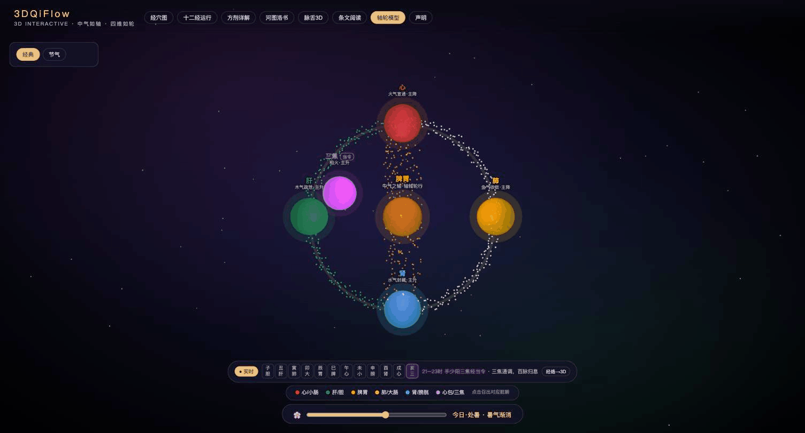

# 3DQiFlow

**A 3D interactive engine for the "Round Motion" (圓運動) model of classical Chinese medicine** · 圓運動古中醫學 3D 學習引擎

🌐 **Live demo: [3dqiflow.com](https://3dqiflow.com)** · mirror: [3dqiflow.vercel.app](https://3dqiflow.vercel.app) — the interface is in English by default; a 中文 toggle sits in the top-right.

🌌 **Ambient spin-off: [cosmic.3dqiflow.com](https://cosmic.3dqiflow.com)** — the *Cosmic / 天人* page as a standalone full-screen site ([MuzikPro/cosmic](https://github.com/MuzikPro/cosmic)); same engine, one page, no menus.



3DQiFlow lets you **see** the qi-circulation model described in Peng Ziyi's *The Round-Motion TCM* (圆运动的古中医学, 1920s) and Zhang Zhongjing's *Shanghan Lun* (伤寒论) — instead of only reading about it. Rotate the axis-wheel model, watch the 12 meridians flow simultaneously as paired ascending/descending circles over an anatomical body, decompose classical formulas into 3D herb spheres, and walk the 24 solar terms around a seasonal ring.

> 中气如轴，四维如轮；轴运轮行，轮运轴灵。
> *The center qi is the axle, the four aspects the wheel.* — Peng Ziyi

## What this is — and what it deliberately is not

It is a **study tool for a textual and conceptual tradition**: the thing being visualized is what the classical sources *claim*, laid out so it can be understood and memorized.

It is **not** a clinical tool, and that is enforced in the architecture rather than in a disclaimer:

- **No symptom → point or symptom → formula lookup.** Traditional indications are not in the search index at all; search matches names only (points, meridians, vessels, formulas, passages). A searchable symptom is a recommender however it is worded, and that line is not crossed.
- **No procedural content.** Needling depth, angle, technique, bloodletting, moxibustion parameters and emergency/pregnancy treatment are excluded — even where a source puts them in the same sentence as content that is included.
- **Provenance is a data field, not a footnote.** Every content string is traceable to a named source; where a source is silent, the UI says so instead of filling the gap. Nothing is presented as reviewed or standard when it is not.
- **Coordinates are honest about their status.** Acupoint positions are labeled `schematic_unvalidated` in the data *and* on screen: they are derived from textual location rules, not from cadaver measurement, and must not be used to locate points on a real person.

Contributions are held to the same lines — see [CONTRIBUTING.md](CONTRIBUTING.md).

## Features (open-source engine)

- **Acupoint Atlas 经穴图** — 362 points across the 14 meridians plus the eight extraordinary vessels, on male and female bodies, with name-only search, qi-flow animation, and a display-only 子午流注 (midnight-noon) meridian clock
- **Meridian Theater 十二经运行** — 12 meridians as 6 paired 升降 circles (yin ascending / yang descending) flowing at once over a 3D body in canonical order (如环无端), plus a route-mnemonic teaching diagram
- **Formula Explorer 方剂详解** — 君臣佐使 (sovereign/minister/assistant/envoy) decomposition with per-herb rise/fall roles and derivation trees, beside a live axle-wheel stage: selecting a formula plays its fault (axle failing / wheel stalled) and the herbs take their places on the circle to restore it
- **Article Reader 条文阅读** — dual-pane Shanghan Lun reader: original text and pinyin on the left, a round-motion reading driving a live 3D pathomechanism scene on the right
- **Axle & Wheel 轴轮模型** — central qi (spleen/stomach) as the axle, liver/heart/lung/kidney as the four wheels, with the ministerial-fire (相火) path, and a 24-solar-term seasonal skin
- **Hetu & Luoshu 河图洛书** — interactive 3D disks of the model's cosmological source
- **Pulse & Tongue 脉舌3D** — 3D pulse waveforms and a sculpted tongue with coating zones
- **Cosmic Meridian Screensaver 屏保** — the translucent body floats in the starfield with all 12 meridians and 8 extraordinary vessels flowing at 0.1x; camera orbit or body rotation, meridian picker, FOV/fullscreen, settings persisted locally
- **Bilingual UI** — full English / 中文 interface (Japanese partial). Classical content stays in the original Chinese: it is never machine-translated, because inventing an authoritative-looking rendering of a classical medical text is its own kind of fabrication.

## Data provenance and validation

### Where each kind of data comes from

| Layer | Source | Status |
| --- | --- | --- |
| Body meshes (male, female) | NIH 3D / Human Reference Atlas, underlying data NLM Visible Human | CC BY 4.0, decimated and rescaled; geometry undistorted ([NOTICE.md](NOTICE.md)) |
| Vertebra ladder, toe registration | HuBMAP CCF; Univ. of Denver Center for Orthopaedic Biomechanics | CC BY 4.0 |
| Acupoint location text (定位) | GB/T 12346-2021 wording | 11 of 362 ship here as a sample; the rest are withheld — publicly viewable ≠ redistributable |
| Acupoint coordinates | Derived by us from the location text (below) | `schematic_unvalidated` — **never** clinically validated |
| Meridian routes | Project-authored teaching routes over the mesh | Teaching schematic, not dissection-traced |
| Classical text (伤寒论, 圆运动) | Public domain (Zhang Zhongjing; Peng Ziyi, d. 1949) | Verbatim, untranslated |
| Round-motion readings, pathomechanism notes | Written by this project | Study notes — **not expert-reviewed** |

### How coordinates are placed: landmark-first, never eyeballed

No point is dragged onto the mesh by eye. Each one is placed by a rule of the form
**anatomical landmark + bone-proportional (骨度分寸) distance taken from that point's own location text**, then projected along the surface normal. The landmarks (axilla, elbow, wrist, hip, knee, ankle, and the digit anchors) are measured off the mesh itself rather than assumed, and the limb centerlines are walked to place points along a limb.

Every derived point carries the rule that produced it, in the shipped data:

```ts
{ code: 'BL1', zh: '睛明',
  rule: '面部：按標誌幀高度（face）落位，橫向取該高度頭面半寬比例',
  note: '只定高度帶與橫向比例，未定位到具體五官特徵點；已從體內提回體表', … }
```

So you can read *why* any point sits where it does, and disagree with a specific rule rather than with a black box. The female body is not the male coordinates rescaled — her points are re-derived from her own landmarks.

**The generator scripts are not in this repo** (they belong to the content tooling). What is here is their output plus the audit that checks it, so the invariants are independently verifiable even though the derivation is not independently reproducible from this repo alone. That asymmetry is a real limitation, listed again under known gaps.

### Per-point review status

Review state is a field in the data, not a page of prose. Every acupoint declares one:

- `source_checked` — location text traced to its source (**11 points**, the Lung meridian sample)
- `content_pack_only` — location text withheld from this repo (**351 points**); the UI says so on the point card rather than showing an empty field

A test asserts these can never disagree: a point either has location text *and* `source_checked`, or has neither. Half-true states fail the build.

### What the tests enforce

```bash
npm test          # content-safety gate + data audit (14 assertions)
npm run audit     # data audit only
```

**Content safety** (`src/utils/contentSafety.ts`, `test/content-safety.test.ts`) scans every project-written string shipped in the repo — UI dictionary, derivation rules, round-motion readings — and **fails the build** on:

- procedural medical guidance: needle depth/angle, moxibustion dosage, bloodletting, electro-stimulation;
- recommendation language: imperative point-selection, second-person treatment advice, cure claims.

Classical **administration text** (煎服法 — "decoct in seven sheng", "take warm, three times daily") is handled differently: it is *registered, not blocked*. It is verbatim Shanghan Lun quotation and it is what a 经方 substantially *is*, so it is displayed as quotation under 服法要点 rather than suppressed — but it is counted, so it cannot drift into project-written prose unnoticed. That distinction is the point: the gate separates *our* wording from *the source's*.

It also asserts the search index stays name-only, and that acupoint records carry no indications field at all — a searchable symptom would make this a symptom→point recommender however the entries were worded. Crucially the scanner is **falsifiable**: a test feeds it known-bad strings and fails if they are *not* caught, so a passing suite means something.

That falsifiability test exists because the first version of this scanner was wrong. Run against the full content corpus (9,906 strings), it found **nothing** — not because the corpus was clean, but because the dosing pattern expected `每日三剂` while the classical text says `日三服`. It missed 71 real strings, and one piece of project-written prose that stated a dose allowance rather than reporting what the source records. Both are fixed; the corpus strings it originally missed are now regression tests. A safety gate that has never been shown to catch anything is decoration.

**Data audit** (`test/data-audit.test.ts`) checks the output invariants of the derivation: coordinates inside the body frame, no non-finite values, unique point codes, both bodies covering the same point set (catching half-finished re-derivations), and mirrored positions actually mirroring. It also records how much degenerate data the render layer absorbs, so that number failing upward is a signal to fix the generator rather than thicken the patch.

## Known gaps — what we have *not* validated

Published deliberately. A tool about the body that hides its error bars is worse than one that shows them.

- **No coordinate has clinical validation.** Positions are derived from text, never measured on a cadaver or a person, and never checked by a licensed practitioner. They are labeled `schematic_unvalidated` in the data and on screen, and must not be used to locate points on anyone.
- **37.6% of raw meridian route points are degenerate duplicates** (8,823 → 5,503 after dedup; the Yang Heel Vessel mirror had 737 of 1,239 points coincident). These are absorbed at render time by `meridianPolyline`, not fixed at the source, because the generator is not in this repo. Degenerate points had already caused one whole vessel to silently fail to draw — correct numbers, correct state, nothing on screen.
- **The derivation is not reproducible from this repo.** You can audit the output; you cannot re-run the generator.
- **Female toe positions are a proportional mapping**, not registered to her own phalanges the way the male toes are. Neither mesh has separated fingers or toes on the surface, so digit-tip points sit on a merged surface.
- **351 of 362 points ship without location text**, so most of the atlas cannot be checked against its own stated rule from this repo alone.
- **The content-safety scanner is pattern-based.** It catches the formulations it knows about; it is a gate, not a proof. Its first version silently passed a corpus containing 71 violations because the patterns were written from imagination rather than from the data — novel phrasing can still pass it today, and reports of a miss are treated as bugs.
- **No content here has expert review.** Round-motion readings and pathomechanism notes are study notes. Where the commercial pack contains entries with no documented source, they are marked as model-derived and unsourced in the UI rather than being quietly presented as reference material.
- **Coverage is uneven.** The Lung meridian is the most carefully worked; other meridians rely more on the whole-meridian repositioning pass than on per-point derivation.

## Open core: what's in this repo vs. not

This repository contains the **full 3D engine and structural theory data** (organs, meridian pairs and routes, solar terms, Hetu/Luoshu, acupoint atlas) plus **sample content** so everything runs out of the box.

The complete annotated content set — 96 Shanghan Lun articles with round-motion interpretations, 39 formulas with full animation scripts and derivation trees, complete pulse/tongue atlas, and the 7-stage guided curriculum — is part of the commercial content pack at [3dqiflow.com](https://3dqiflow.com). The engine is designed so content packs drop into `src/data/` without code changes: the deployed demo overlays the full article/formula datasets at build time via `scripts/fetch-content-pack.mjs` (a credentialed prebuild step that is a no-op for contributors — without credentials the app builds with the sample data in this repo).

## Quick start

```bash
npm install
npm run dev        # http://localhost:5174
npm run build      # typecheck + production build
```

Requires Node 18+ and a WebGL2-capable browser.

## Tech stack

React 18 + TypeScript (strict) · Three.js + React Three Fiber + Drei · Vite · CSS-in-TS theme system (`src/styles/theme.ts` — never hardcode colors)

## Architecture

```
src/
├── styles/theme.ts        # Five-element color system (fire/wood/earth/metal/water/phase-fire)
├── data/                  # Theory data (open) + sample content (trimmed)
├── utils/academicCheck.ts # Academic red-line enforcement
├── components/            # One folder per 3D scene + shared UI
├── i18n.ts                # Language store + tr() lookup
└── i18nDict.ts            # zh → en UI dictionary (falls back to Chinese, never invents)
```

## Academic integrity

TCM content follows strict academic red lines (see [docs/ACADEMIC_REDLINES.md](docs/ACADEMIC_REDLINES.md)): 中气 always means spleen/stomach qi, only classical formula names are used, meridians are modeled as 6 paired 升降 circles nested in one grand circle, and teaching mnemonics are always distinguished from canonical text. Contributions must pass the same checks.

The original texts of 《圆运动的古中医学》 (Peng Ziyi, d. 1949) and 《伤寒论》 are in the public domain. The 3D body models in `public/models/` are CC BY 4.0 — see [NOTICE.md](NOTICE.md) for the full attribution map.

## Contributing

PRs welcome — especially translations (an English rendering of round-motion terminology is an open problem), scene performance, and accessibility. Start with the [good first issues](https://github.com/MuzikPro/3dqiflow/issues?q=is%3Aissue+is%3Aopen+label%3A%22good+first+issue%22), and read [CONTRIBUTING.md](CONTRIBUTING.md) first — the safety red lines there are PR acceptance criteria.

## Disclaimer 免责声明

**This is an educational tool only. It does not provide medical advice, diagnosis, or treatment. Consult a licensed practitioner for any health concern. 本项目仅供学习交流，不构成任何医疗建议、诊断或治疗方案。**

## License

Code: [MIT](LICENSE). Body meshes in `public/models/`: CC BY 4.0 (attribution required — see [NOTICE.md](NOTICE.md)). Sample content data in `src/data/`: CC BY-NC 4.0 (attribution, non-commercial). The commercial content pack is not covered by any of these. Full licensing map: [NOTICE.md](NOTICE.md).
